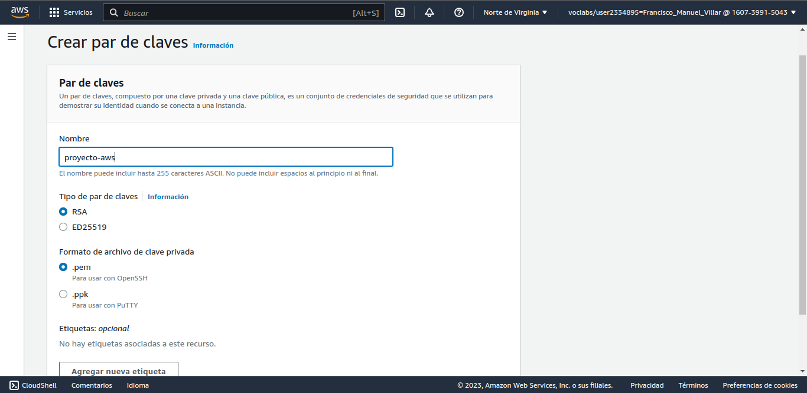
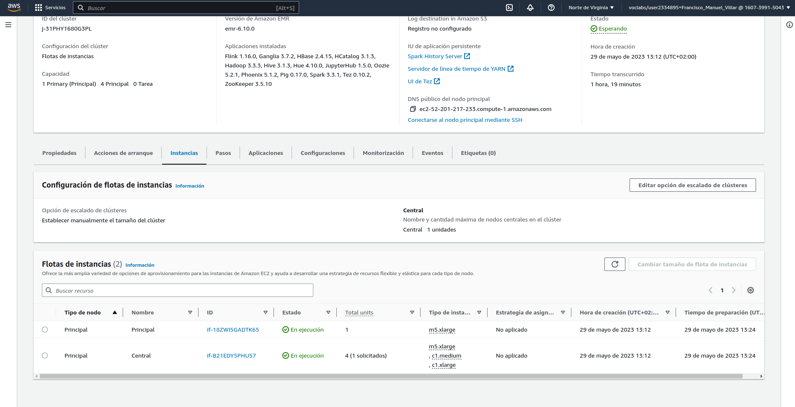

# Big Data Aplicado
## Proyecto Final

### Proyecto 3: Cluster Apache Hadoop en la nube

1. Crear un cluster Apache Hadoop en las 3 diferentes plataformas Cloud que te lo permiten
   1. AWS
   2. HDInsights
   3. DataProc
2. Detalla su instalación, configuración y despliegue en cada una de ellas.
3. Detalla las diferencias entre cada uno de ellas
4. Debes intentar desplegar todo el ecosistema completo de cada nube
   
### Proyectos. Requisitos comunes

1. Debe haber como míninmo 3 nodos en el cluster.
2. Añade todos los nodos que necesites para desplegar toda la plataforma Apache Hadoop de tu proyecto justificándolo adecuadamente.
3. Deben soportar acceso concurrente desde varios nodos Edge.

### Proyecto 3: Cluster Apache Hadoop en la nube

# AWS

# Introducción

# Dibujo de EMR en AWS para la creación del clúster con todas las aplicaciones posibles instaladas
Vamos a proceder a crear un cluster con 3 nodos principales, 1 esclavo y 1 para tareas en EMR que es como se llama nuestro Hadoop en AWS.
Podemos definir el ecosistema con las siguientes aplicaciones:
Para ingesta de datos tenemos a Glue y Flink que reemplazan a Sqoop y Storm.
Para procesamiento tenemos a Pig, Hive, Spark, Tez.
Para visualización tenemos Hue
Para consultas de bases de datos no relacionales tenemos Phoenix que reemplaza a lo equivalente a un MongoDB
Para monitorización tenemos Ganglia
Para planificación tenemos Oozie 
Para almacenamiento tenemos Hive y HBase.
También tenemos Zookeeper para la coordinación.
Para almacenamiento de metadata tenemos a HCatalog.
Tenemos Jupyter Notebook para la visualización de datos.

Foto de nuestro ecosistema en AWS, vamos a desplegarlo con 1 nodo master y 4 workers.


# Vamos a hablar sobre EMR

Primero debemos crear un par de claves de EC2 antes de lanzar el clúster.
Vamos al siguiente enlace para ver la información: https://docs.aws.amazon.com/AWSEC2/latest/UserGuide/create-key-pairs.html
Luego desplegamos nuestro laboratorio y nos vamos a la parte de EC2, buscamos red y seguridad -> Pares de claves.
Le damos a Crear par de claves, le damos un nombre y seleccionamos la extensión que queramos según el programa que usemos para conectarnos a la máquina.

Buscamos EMR y creamos un clúster.
Le damos a Crear clúster, le damos un nombre y seleccionamos la versión que queramos en mi caso voy a optar por la última versión(6.10.0), seleccionamos el paquete de aplicaciones Core Hadoop, seleccionamos usar para metadatos de la tabla de Hive seleccionamos versión de Amazon Linux, aplicamos las actualizaciones más recientes, en la configuración del clúster seleccionamos grupos de instancias, seleccionamos usar varios nodos principales, en la principal, central y tarea 1 de 1 que le vamos a dar el nombre de prueba seleccionamos el tipo de instancia de m5.xlarge, le damos un tamaño al volumen raíz de EBS de 50, seleccionamos utulizar escalado administrado por EMR, damos un tamaño minimo de 3 y máximo de 20 para el cluster, dejamos los 20 nodos principales como cantidad máxima de nodos en el cluster, seleccionamos el tiempo de inactividad que queramos para nuestro nodo, seleccionamos nuestra clave ssh, aquí como reemplazo de los nodo edge tenemos tenemos los nodos de task seleccionamos EMR_DefaultRole como rol de servicio en Amazon EMR, seleccionamos EMR_EC2_DefaultRole como rol de servicio en Amazon EC2, lo creamos y nos saltará un error de que tenemos que configurar una base de datos externas en hue-ini.
Buscamos RDS, creamos una base de datos, en tipo de motor seleccionamos MySQL, seleccionamos la opción clúster de base de datos multi-AZ nuevo, le damos el nombre que queramos y la configuración de nombre de usuario maestro y contraseña que veamos, dejamos como viene la configuración de la instancia
Ver los datanodes en el clúster a traves de hdfs
```
sudo -u hdfs hdfs dfsadmin -report
```
Para acceder a las ui debemos crear un túnel ssh con el siguiente comando, dejo un ejemplo para la interfaz de hdfs:
```
ssh -i proyecto-aws.pem -L 9870:ec2-52-201-217-233.compute-1.amazonaws.com:9870 ec2-user@ec2-52-201-217-233.compute-1.amazonaws.com
```
Y escribimos en el navegador
```
localhost:9870
```
Podemos ver los archivos de instalación de las aplicaciones en el siguiente directorio:
```
ls /usr/lib/
```
Si queremos que nos describa nuestro cluster debemos poner el siguiente comando:
```
aws emr describe-cluster --cluster-id j-31PHY1680G3PL --output text
```
Si queremos ver cuantos son master y workers debemos poner el siguiente comando:
```
aws emr list-instances --cluster-id j-31PHY1680G3PL --instance-group-types MASTER CORE TASK --output text
```
O
```
aws emr list-instances --cluster-id j-31PHY1680G3PL --query 'Instances[].{InstanceType:InstanceType, PrivateIpAddress:PrivateIpAddress, PublicIpAddress:PublicIpAddress, Status:Status.State}'
```
También podemos verlo de modo gráfico si seleccionamos el cluster, le damos a ver detalles, instancias y nos saldrá algo como esto:


# Creación a través del CLI de AWS
Como es lógico también podemos crear el clúster a través del CLI de AWS, para ello debemos tener instalado el CLI de AWS y configurado con nuestras credenciales de AWS.

Dejo el siguiente código de ejemplo:
```
aws emr create-cluster \
 --name "Mi clúster" \
 --release-label "emr-6.10.0" \
 --service-role "arn:aws:iam::160739915043:role/EMR_DefaultRole" \
 --ec2-attributes '{"InstanceProfile":"EMR_EC2_DefaultRole","EmrManagedMasterSecurityGroup":"sg-07b833c4ee60ccaad","EmrManagedSlaveSecurityGroup":"sg-0abc8ffebb9297555","KeyName":"proyecto-aws","AdditionalMasterSecurityGroups":[],"AdditionalSlaveSecurityGroups":[],"SubnetId":"subnet-0372a2f72adaf06b3"}' \
 --applications Name=Flink Name=Ganglia Name=HBase Name=HCatalog Name=Hadoop Name=Hive Name=Hue Name=JupyterHub Name=Oozie Name=Phoenix Name=Pig Name=Spark Name=Tez Name=ZooKeeper \
 --configurations '[{"Classification":"hive-site","Properties":{"hive.metastore.client.factory.class":"com.amazonaws.glue.catalog.metastore.AWSGlueDataCatalogHiveClientFactory"}},{"Classification":"spark-hive-site","Properties":{"hive.metastore.client.factory.class":"com.amazonaws.glue.catalog.metastore.AWSGlueDataCatalogHiveClientFactory"}}]' \
 --instance-fleets '[{"Name":"Principal","InstanceFleetType":"MASTER","TargetSpotCapacity":0,"TargetOnDemandCapacity":1,"InstanceTypeConfigs":[{"WeightedCapacity":1,"EbsConfiguration":{"EbsBlockDeviceConfigs":[{"VolumeSpecification":{"VolumeType":"gp2","SizeInGB":32}},{"VolumeSpecification":{"VolumeType":"gp2","SizeInGB":32}}]},"BidPriceAsPercentageOfOnDemandPrice":100,"InstanceType":"m5.xlarge"}]},{"Name":"Central","InstanceFleetType":"CORE","TargetSpotCapacity":0,"TargetOnDemandCapacity":1,"InstanceTypeConfigs":[{"WeightedCapacity":4,"EbsConfiguration":{"EbsBlockDeviceConfigs":[{"VolumeSpecification":{"VolumeType":"gp2","SizeInGB":32}},{"VolumeSpecification":{"VolumeType":"gp2","SizeInGB":32}}]},"BidPriceAsPercentageOfOnDemandPrice":100,"InstanceType":"m5.xlarge"},{"WeightedCapacity":2,"EbsConfiguration":{},"BidPriceAsPercentageOfOnDemandPrice":100,"InstanceType":"c1.medium"},{"WeightedCapacity":8,"EbsConfiguration":{},"BidPriceAsPercentageOfOnDemandPrice":100,"InstanceType":"c1.xlarge"}]}]' \
 --scale-down-behavior "TERMINATE_AT_TASK_COMPLETION" \
 --os-release-label "2.0.20230504.1" \
 --region "us-east-1"
```

# HDInsights
Primero antes de todo te tienes que registrar para usar HDInsights, una vez que tengo el cluster puedo añadir más
# DataProc
Habilitamos la API lo primero, le damos a la opción CREATE CLUSTER, nos da la opción de crearlo en Compute Engine y Google Kubernetes Engine
# Bibliografía
Aquí dejo todos los links que he usado para este proyecto:
https://aws.amazon.com/es/emr/features/hadoop/
https://docs.aws.amazon.com/emr/index.html
https://docs.aws.amazon.com/es_es/emr/latest/ReleaseGuide/hue-rds.html